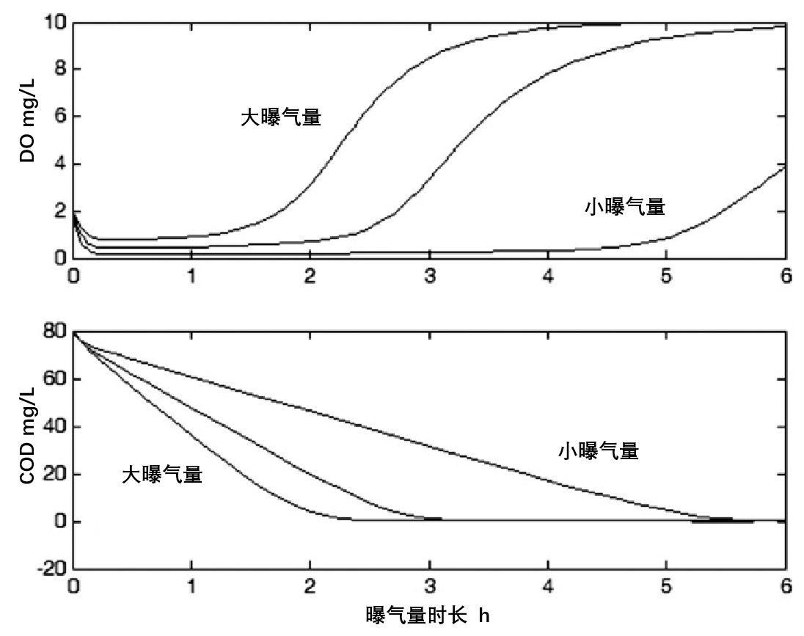

# 2. 早年
在20世纪70年代初期，生物系统的控制是一门艺术而不是科学，自动化系统的基础——基本动力学正在变得越来越重要。这就自然而然地提出了“探测器”或仪器、控制方法、操作设备和计算机程序的问题。另一方面，化学过程则不会受到生物过程所谓的难以预测的情况影响。人们认为，反应池中的化学过程是直接的，而且为了过程控制能够很容易地被仪表化。

自动化已被应用于商业生物生产系统，如啤酒或抗生素的制造，但不适用于污水处理系统。污水处理系统运行的理论背景比较弱，能够用于不利环境中的合适的仪器非常有限，操作人员的教育水平远不如现在。生物处理过程中固有的困难包括原水不断变化和不可预测的性质，以及大量污水的处理需求，同时还试图利用其中0.03~0.06％的有机物质作为连续生物反应的底物。

## 2.1 第一次ICA会议
1971年在维也纳召开的由IAWPR（国际水污染研究协会，IAWPRC 、IAWQ和IWA的前身）组织的“大型污水处理厂设计与运行的相互作用”会议成为了关注ICA的一项重要活动。一些操作人员意识到，设计师们一直在专注于污水处理厂自动化的工作，而没有完全意识到其他地方发生了什么。会议上开展的热烈讨论清楚地表明，ICA这一主题是如此的广泛，而后续会议应该专门讨论这些令人感兴趣的地方。

由IAWPR主办的第一次仪器与控制会议于1973年在伦敦举行，得益于主办方Carmen Guarino（费城，美国），Tony Drake（大伦敦理事会，英国），John F. Andrews（克莱姆森大学，美国）和Ron Briggs（水污染研究实验室，英国）所做的努力。这是我第一次参加ICA会议，接下来，直到2009年，是IWA及其前身组织的每四年一次的九次会议。

我开始了自己作为核工程师在瑞典电力行业的个人旅程，然后在20世纪60年代变成了一名控制工程师。1972年开始向水利工程师转型。隆德大学自动控制系第一位博士生Karl Eklund博士加入了瑞典阿克塞尔·约翰逊工业研究所。他是在1972年向我提出关键问题的人：“在我看来，所有的污水处理厂都是按照稳态原理设计的。然而，系统似乎从未处于稳定状态。这其中是不是有自动控制的作用？“我答应启动一项可行性研究。在那之后，我被污水处理控制所吸引。正如在伦敦会议上所表达的那样：“对我们来说，接受这些变化是非常重要的，但是面对表现出其对绩效影响的任务，只能说，目前还没有数据可以评估其效果”。看上去，这对控制工程师们来说是一个很棒的挑战。干扰和动态变化激发了控制理论的整体存在！然而那个时候，我却很难预测到我会终身投入水行业领域。早期的两个报告（Olsson等人，1973； Olsson，1974）总结了控制方面的挑战和问题，为下一个十年控制污水处理系统的工作奠定了基础。

伦敦1973年的会议吸引了225人，发表了64篇论文。在会议上，来自亚特兰大、芝加哥、伦敦、洛杉矶、巴黎和费城等大型城市工厂中的几个计算机系统都被展示出来。计算机系统通常用来数据采集，却几乎没有任何闭环的工厂控制过程。一些通过计算机实现的PID控制器的低级控制过程也被演示出来。美国约50个城市污水处理厂的调查显示，只有少数几个低水平的闭环控制，通常称为PLC控制。很少有论文研究ICA方面的问题，而且所提出的大多数控制系统都是在经验基础上设计的。

仪器仪表是关键。用于污水控制的传感器似乎是为其他行业开发的传感器，并不适用于通常恶劣的污水处理条件。已在8个欧洲国家比较了他们的仪器仪表。德国在仪表领域似乎最先进，适用于污水和河流水域的监测。有几位作者提出了溶解氧（DO）的控制，潜在节能得到了充分的认可。Ron Briggs（1973）已经在Rye Meads污水处理厂的硝化工艺设施中进行了DO控制，Chuck Wells和Dave Stepner在加利福尼亚州Palo Alto城市污水厂进行了DO控制（Petersack and Stepner，1973）。John Andrews对活性污泥系统提出了一些控制问题，并展示了模拟结果。这里提到的四个人这些年来给了作者很多启发。

实际上，许多国家都缺少合格的运营商。随着新规定的出台，这个缺口更大了。而自动化似乎可以解决这个问题。然而，这被看作是对许多工人和工会的真正威胁，对失业的恐惧是20世纪70年代自动化发展的障碍。对于这种恐惧，我们在第2章第4节中有讲述第一手的经验。尽管如此，逐步淘汰“未受过专业培训”的劳动力被认为是实现最佳经营效率的唯一解决方案。后来，英国的L.H.Thompson于1977年在伦敦发表观点称：“在很多情况下，使用自动化系统的理由很可能不在于减少员工，而在于对可变操作环境做出更快更可靠的反应。” ICA后来的发展已经证明这个说法的正确性。

Kukudis（1973）在1973年伦敦会议上的一个观点反映了控制的可能性：“即使我们拥有最先进的自动化工厂，仍然无法以最高的效率运行，因为污水处理厂的设计基于统一的污水流量，同时要考虑到由暴雨带来的周期性强度，或由干燥天气引起或最低需求时段的周期性低位。所以，大部分时间进入处理厂的流量要么高于，要么低于最高效率水平。“控制则可以将可用但通常未使用的那部分容量用起来。这就迫切需要控制排水管网的流量。“我们必须从整个系统——整个排水和处理厂网络范围来谈自动化”。这是几乎四十年前所提出的！而今天，我们仍然需要实现更完善的全厂范围的控制，而且要设计最大负荷条件。这能预留出巨大的优化空间。20世纪70年代早期，克利夫兰（城市名）采用了排水管网控制（Kukudis，1973）。在干燥期，流量均衡。在暴雨期，该系统的设计主要是为了获取和处理暴雨期前20分钟的流量。这就是我们今天所说的降雨初始冲刷效应，此时污染物浓度是最高的。在第一阶段之后，出现的任何分流都将是稀释后污水。

在生物过程的自动化方面，大部分工作很明显都是为了更好地了解过程，即更好地了解动力学并获取更好的在线传感器。20世纪70年代早期，这些发展很明显都来自污水工业本身。当然了，可以是仪表和自动化专家学习污水处理过程，或者污水处理专业人员学习自动化理论和仪表开发。

## 2.2 开创性的自动化控制项目
在20世纪70年代，自动化的含义并不明确。最接近完全自动化的发展被认为是航天器领域，而航天器领域必须有绝对的可靠性，因此每个关键操作部分都需要100%重复。（第一次登月是在1969年，计算机配备了64千字节的核心存储而且没有磁盘。使用了64千字节的阿波罗计算机在实时计算软件上投入了大约1000个人工作年来完成。尽管如此，在月球上着陆的自动驾驶仪并没有如预期的那样工作，最终控制不得不由宇航员接管。）人们很快就意识到，成本本身就阻止了地球上的各种过程的完全自动化。过程控制的步骤必须通过安装可执行控制和建模的计算机来加速进行。当已经获得了必要的动力学理论和传感器时，计算机还可以提供能够对生物过程进行控制的可扩展平台。应当指出的是，自动化并不是为了节省人力，而是为了提高运行的可靠性和设施能力。直接数字控制（DDC）这个术语被定义为一个反馈系统，其中所有的控制器都是以分时方式在数字计算机中实现的。

其中一个例子就是南加州的Hyperion工厂。为了实现过程自动化的规划，从1968年到1973年采取了很多措施。他们研究了活性污泥工艺的动力学，并与计算机模型进行了比较。Smith和Eilers（1969），还有Bargman和Borgerding（1973）提出了一个稳态模型。该模型对活性污泥停留时间、气流、厌氧消化池污泥进料和消化回收实现DDC（直接数字控制）（Bargman等人，1973）。

Bayley和Ayling（1973）也认识到反硝化可以节约能源。在其活性污泥运转中，大约三分之一所需的氧气被用于将铵态氮氧化成硝酸盐。作者发现，如果可以将一定比例的这种氧化氮用作氧化有机物质的氧源，那么应该可以随时减少“外部”曝气的需求。1973年，控制氧化氮排放到不列颠群岛的地表水中也是不必要的。因此，当时脱硝也只是为了节能。

## 2.3 对溶解氧动力学的理解
Briggs等人在英国首次尝试使用半连续色度计，并采用Winkler方法连续测量DO（1954）。后来Briggs等人，又用滴汞电极取代了之前的方法（1957年）。到20世纪70年代初，许多污水处理厂已经使用在线DO传感器。人们很早就意识到DO控制对于生物活性和工厂效率都是非常有利的。用于反馈控制的DO传感器已经在1967年进行中试（Briggs等人，1967），并在Rye Meads污水处理厂（Briggs，1973）进行了全面的实验。根据Rye Meads的经验，牛津市污水处理厂实施了DO控制（Meredith，1973）。在法国，Paul Brouzes展示了DO控制（Brouzes，1969），同时在美国，也有一些DO控制的尝试（Petersack和Stepner，1973; Roesler，1974）。在美国内华达州的Reno污水处理厂，从1966年开始，DO控制就已经应用。

显著的节能表现也被各种报告提及。值得一提的是，DO的级联控制已经被实现，比如位于纽约州长岛Nassau县的Wantagh处理厂（Beckman，1973）。在每个曝气池中测量溶解氧，然后将数据传输到主控制器。 DO控制器将设定输出值输入到水池的气流控制器中，给出了气流速度的最小和最大限值，然后每个箱的气流情况通过中央处理器汇总，并将这些信息用于鼓风机控制系统。

对使用溶解氧浓度的控制设计也存在一定质疑。原因是“在污水生物过程的自动化系统设计中，往往存在采用测量仪器制造商现有检测器的检测参数的倾向，而不是根据该生物过程本身的动力学参数标准”（Bargman等，1973年）。DO就是一个给出的现成例子。原因是“如果生物体死亡、（或）没有足够生物体，活性污泥池就会出现溶解氧饱和，并会出现过少或没有BOD（生化需氧量）或COD（化学需氧量）减少”。相反，活性生物体的呼吸过程将是生物过程条件的直接指标。

在1973年伦敦会议的启发下不久，我们开始在瑞典大型污水处理厂Ka¨ppala工厂进行实验。该厂于1969年建成，服务于斯德哥尔摩北郊的30~40万人。这是安装计算机系统（西门子）进行在线数据采集的首批工厂之一。这促成了1977年伦敦ICA会议在斯德哥尔摩重新召开。该工厂完全建造在地下。平均干燥天气流量为1.3m3 / s。活性污泥装置设计为6列平行列，每个池容积为6000 m3，长度为100m。空气由微孔曝气器沿反应池均匀供应。对我们的实验来说，实时数据可以存储在计算机中，并保存在打孔的纸带上，供以后在隆德大学自动控制学院使用我们的智能设备PDP 15/35计算机进行分析。

从1973年底到1975年中期，我们在Ka¨ppala进行了大量的过程辨识实验。辨识实验的目的是直接从实验中辨识DO动力学。DO动力学比水力学要更快，并且底物的利用使得它可以在自己的时间范围内进行自我隔离。通过故意干扰进入曝气反应池的空气流量，沿反应池的各个位置的DO浓度变化被记录下来。通过将流量转向其他平行流域来操纵进水流量，并且有目的地控制回流污泥流量以对DO浓度产生干扰。这里有三个可以单独改变的控制变量。假设DO浓度 y(t) 与气流量u1(t)，进水流量u2(t)，和回流污泥流量u3(t)有关：

采样时间∆t必须仔细选择，并且要足够小，以便记录所有相关的动态变化现象。尽管如此，它也必须足够大，以便所有数据可以被存储下来。应当记住的是，典型的主存储器大小是16千字节。变量e是随机变量，通常以标准偏差1分布。它是个独立变量，即e（t）的幅度在其他时间与e无关。参数l是缩放幅度。参数ak，bik，λ和ck用最大似然法确定。不同的模型阶次n被尝试，同时模型阶次的最终确定是基于Fischer信息指数或Akaike指数（(A°stro¨m和Eykhoff, 1971; Ljung,1987)），以及从Fischer信息矩阵中估算出的参数精度。我们使用了一个名为IDPAC的交互式软件进行过程辨识，该软件是在隆德大学自动控制系Karl J. A°strom领导下开发的。IDPAC在几个辨识项目中起着重要作用，可以被认为是由Lennart Ljung开发的Matlab系统辨识工具的典范。1973年时，他是该系的博士生。

不久之后，很明显实验中只能发现低阶动力学的存在，人们发现最可靠的模型是一阶的（n = 1）。空气-溶解氧动力学的时间常数估计在15~30分钟之间，具体取决于DO传感器在反应池的位置。根据第一原则，将所确定的模型与完全混合污水中DO浓度模型进行比较，

其中SO是DO浓度，指数in和sat分别表示进水流量和饱和度。Q是污水进水流量，r是回流污泥流量也是Q的一部分，V是体积，KLa是氧传递速率，ro是耗氧速率（有负值）。通常假定KLa与空气流量成正比。研究发现该模型与静态氧传递计算一致。进水流量和回流污泥流量的动力学模型也被限制在一阶，而且可以用物理推理和第一原理模型来解释。显然，气流的影响远超其他进料。

一些现象是显而易见的。DO传感器位置的不同，使得从气流到DO浓度的增益也非常不同。很显然，这可以从沿水流方向不同的气流速度解释。原因是曝气器（陶瓷的）堵塞或通过相应的气流阀的气流量太少。另外一个奇怪的现象，只有在时间常数为10秒左右时才被发现。而在1974年，我们对DO和DO探针动力学还没有很好解释。解释这种神秘的现象耗费了不少时间，但是我们当发现DO传感器膜被破坏时，气态氧也因此渗透到传感器内。而这并不能从静态检测中发现，只能从动态变化中发现。因此，在动态变化中发现的快速时间常数（表明意想不到的高氧传递速率）是有问题的传感器的标志。这种现象在第12章第3节中有描述（Olsson和Newell,1999）。后来，有人进行了其他DO探针条件的测试（Spanjers and Olsson，1992）。 DO探针反复进行时间间隔为15~30 s的氧浓度的阶跃变化实验。探针响应的时间常数通过每一步被估计出来，并且这被证明是一种有效指示被污染探针膜的方法。

在20世纪70年代中期的实验中，我们遇到过几个推流式（塞流式）系统。 沿反应池的空气分布只能手动控制，这也曾被认为是一项非常困难的任务。任何由开启沿反应池的阀门引起的变化将立即导致新的气流分布，而这不一定是我们所要的情况。反应池起始端的耗氧速率非常高，而反应池出口附近的耗氧速率则很小。结果表明，DO浓度表现出一条典型曲线，从极低值开始，到反应池的后半部分又急剧上升，并平稳保持5~8 mg/L高浓度水平直到反应池出口，如图1所示。

图1. 均匀曝气连续流反应器的溶氧与COD去除曲线，上图为不同曝气量下的溶氧曲线，下图为对应的COD浓度曲线

如何根据这样一条分布曲线来确定DO的设定值？教科书的推荐值约为2~3mg/L，但这与我们在推流式反应池中的DO控制无关。我们必须找出其他条件下的测量情况。有研究人员对DO浓度对气流变化的敏感性进行了静态分析，发现最大灵敏度出现在分布曲线斜率最大的区域。辨识实验也证实了这一点（Olsson和Hansson，1976a）。

经验丰富的操作人员，特别是Torpey（1948）根据经验发现，DO分布曲线在反应池长度约75％处才会变得平稳，而这表明反应已经完成。很明显，DO控制应确保DO分布曲线能够在某个期望的位置变得平稳。太早意味着使用了过多空气，太迟又意味着负荷过高，需要更多空气。换句话说，为了找到反应终点的曲线斜率，我们需要两个不同的DO探针，或者两个不同位置的混合液采样，然后用同一个探针进行分析。Olsson和Andrews在1978年的论文中（1978）详细讨论了这一点。

人们也尝试了DO控制的替代方法，最终意识到由于各区域独立供气很不常见，我们不得不接受DO浓度具有特征分布。如图1所示，当反应完成且COD浓度接近零时，DO曲线具有最大斜率。对于较高气流量的情况，出口方向的 DO曲线斜率则很小。这表明在斜率增加到一定值以上前可以减少气流量。另一方面，如果气流太小，那么分布曲线将不会沿着出口方向上升。在实施过程中，我们测量了两个DO浓度，一个在靠近反应池出口，另一个在沿反应池80%左右的位置。确定传感器之间的距离，以便能够以合理的精度计算浓度差。如果差异小，则在差异变得足够大之前，（总）气流会呈减少趋势。为了确保适当的曝气环境，混合最小气流也需要确定。而且，如果气流太低，DO分布曲线将不会沿出口方向上升，而这个小斜率值会错误地表示高气流。为了避免这种误解，出口DO浓度总是必须超过一个特定值。

使用两个传感器的话，也存在一个问题。它们必须进行适当校准，因为要计算两个浓度之间的差值。因此，另一种类型的实施方式是：将两个不同位置的水泵送到单个传感器。显然，这样输送水以及随后带来的时间延迟可能在DO浓度中产生极大的误差，因此必须对测量值进行修正。这一结论在1977年的ICA会议上发表（Gillblad和Olsson，1977）。作为研究人员，我们很自豪地得到了会议召集人C.H.Wells的以下评论：“这篇文章，是有效利用数字计算机来控制实际过程的首次尝试。这些研究人员开发出一个智能控制系统来测量曝气器中6个点的悬浮固体（SS）和溶解氧（DO）。这个控制系统基于现有仪器仪表所提供的信息。这表明，这些信息和工艺过程知识可以为操作人员提供一个有效的工具来控制工艺过程。这是尝试利用数字计算机系统调节活性污泥工艺性能很棒的第一步。”

今天，众所周知的是，通过独立的空气供应系统可以更好地解决曝气反应池的不同区域DO的分布问题。 然而，DO分布分析为我们提供了很多信息，因为DO分布是耗氧的直接反映。

人们对动力学认识的缺乏持续了很长一段时间。我在20世纪90年代后期的一次亲身经历可以说明这一点。当时，我们正在寻找在美国中型城市工厂进行各种控制实验的机会。工厂操作人员则声称DO不会变化，所以不需要控制。而当我询问过测量数据后，我得到了每天15点手动测量DO而且没有发现DO变化的答复。我虚心询问操作人员能否在24小时内每小时测量一次DO。他接受了我的提议，并且非常惊讶地发现了DO确实有相当大的变化。

## 2.4 早期的计算机控制经验
1973年，典型的计算机是具有28千字节的存储器、近100个模拟输入、大约200个数字输出和15个模拟输出的数字设备公司的PDP8。操作界面通常是黑白CRT（阴极射线管），而纸带则被用作软件介质。同时也有具有大约2000个数字输入、600个数字输出、600个模拟输入和40个模拟输出的大型控制计算机。值得一提的是，过去40年来发生的计算机革命。作者在20世纪70年代为自动控制系购买了一台实时计算机，每个主存储器的价格为1 SEK（瑞士克朗）（≈0.14US$或0.11€）。（事实上，战胜官僚主义去购买一台计算机是一项相当艰巨的任务。这是一个国家层面上的决定：一个计算中心足以为一所大学服务，并且不允许使用其他任何计算机。我们通过简单地称我们的计算机为“实时模拟器”成功购买了它。这台计算机配备了A/D和D/A转换器）。在2011年，每千兆字节我们仅需支付19 SEK，价格降低了约5 * 108。与摩尔定律相比，这非常有趣。 （英特尔公司创始人戈登·摩尔（Gordon Moore）于1965年发现，集成电路每平方英寸的晶体管数量自集成电路发明以来每年翻一番，这是在第一个平面集成电路仅仅四年后被发现的。Moore预测这一趋势将持续到可预见的将来，数据密度大约每18个月翻一番，媒体称之为“摩尔定律”（Moore's Law），而这个名词会一直存在。大多数专家，包括摩尔本人，都认为摩尔定律至少还需要二十年的时间（参见Gordon E. Moore：将更多的元件集成到集成电路上,Electronics,19,3,1965年4月）。在这个时期，Moore预测容量会增加228 ≈ 3 * 108！磁盘存储器也同样如此。我们现在正利用着这场革命的优势吗？

在20世纪70年代中期，使用计算机进行控制存在很多阻力。价格相对较高，同时为了促使如此高昂的投资，需要控制的过程的价值需要比投资高得多。这又意味着很大的复杂性。换句话说，有以下几个障碍需要克服：仪器昂贵，过程动力学又不太为人所知，致动器必须有足够的灵活性，计算机必须充分可靠，并且必须发展出足够的控制理论。

在1975年到1976年期间，我们在Ka¨ppala处理厂的西门子计算机上实施了DO控制（Olsson和Hansson，1976b）。气流量的控制是通过一个PI控制器与一个比例控制器级联实现的。但是，当需要进行更多调整时，我们决定购买一台小型计算机数字设备LSI 11，而不是对西门子计算机进行重新编程。这实际上是第一台运往瑞典的LSI电脑。在1976年到1977年期间，我们利用LSI计算机来获得更多关于DO控制和污水处理厂动力学的经验。我们被警告说传感器的信号质量太低以至于这些信号不能用于过程控制。而这被证明是错误的。许多电缆可能已经不足以支撑这个过程，一些信号电缆已经很接近电力电缆。而数字信号滤波成功地用于消除仪器和信号传输噪声。

也许最困难的障碍来自政治和心理上。潜在的失业风险会是一个敏感的政治问题。淘汰“未受过专业培训”的劳动力将会非常困难。但是，如果要获得最佳效率，提高操作人员的专业技能至关重要。工厂的操作人员害怕计算机，是因为它们可能会夺走操作人员的工作和职责。工厂经理也并不总是能看到计算机的价值。 而且，最困难的也许还是尚不明确的经济激励措施。

1976年，我们与一个行业合作，在瑞典安装了用于中型活性污泥工艺处理厂闭环控制的PDP 11-04计算机，安装于1977年初进行。计算机控制的目的主要是控制 DO浓度和回流污泥流量。计算机中还布置了一些低级控制回路。这台计算机安装的主要目标是获得更好的过程研究的机会。另外，还安装了一个简单的报警检测系统。这是一个基于规则的系统，但是当时还没有“基于知识规则”或“基于规则”这种术语，而且该系统是用实时Fortran来进行编程的（Gillblad和Olsson，1977）。

随着计算机的安装，我们同时开发了一种新型测量取样系统。这个想法构建在中心位置只使用一个传感器和两个悬浮固体（SS）传感器的基础之上。目的是为了更精确地测量DO分布情况，如第二章第3节中所述。将混合液体从曝气池的六个不同部位通过泵传送到传感器，以便在没有校准问题的情况下使用不同传感器进行测量，并比较来自反应池多个部位的DO浓度。每个样品约20L以确保是代表性样品。我们对样品进行了几次快速测量，然后计算得到了一个平均值。这样做的目的是可以使用DO分布形状作为控制行为的基础。通过将整个反应池看作呼吸计的测量方法被用来计算呼吸速率。计算机可以控制测量系统，并能够部分补偿泵送过程中每个样品的DO减少。尽管如此，测量系统还是相当复杂，并没有进一步发展。后来，DO分布控制的想法已经能被更好的观点所取代，用以单独控制反应池的各个区域。

DO控制系统按预期工作，并且前文所提到的那套基于规则的系统也进行了充分检测。这个系统还可以监测警报何时得到纠正，并将其记录在计算机中。但是，这个项目仍有几个项目失败了。原因在于，在规划和设计中没有人考虑到操作人员。因此，操作人员担心他们会失业，也就自然而然地尽力让系统失效。在安装计算机之前，曾有一条规定，如果在突然发生警报，操作人员在规定时间内纠正警报的问题，将得到规定的奖励。现在，计算机可以时刻追踪，大部分情况下所使用的时间比规定时间短得多。因此，操作人员理所当然地不会喜欢这个系统。他们没有认真阅读计算机给出的建议，而只是简单地关掉了打字机，从而消除了报警后纠正情况的时间记录。

另一个问题则是缺乏经济鼓励。我们可以很容易地计算出通过使用闭环DO控制可以节约很多。但问题是市政处理厂并没有利润激励。因此，我们遇到的争议理由很简单：“这可以节约20%，30%甚至40%的曝气成本。但是，如果我们采取这种方式，那么明年我们只会得到相应更少的预算。那样我们什么都得不到。”

污水处理控制面临的许多挑战是在70年代初就已经形成的：
* 无论从生物学还是从经济角度来看，溶解氧控制都是非常重要的。尽管如此，并不是所有工厂都实施了DO控制。DO控制采样时间的重要性也得到了充分认可。不过，至今这都不是一个常识。
* 必须考虑沿反应池的耗氧情况。大家已经意识到，反应池入口和出口区域中DO浓度应该被分别控制。但是，这二十世纪七十年代的时候却很难实现。
* 在线仪器仪表的需求是显而易见的。具体需求也已形成，将在第三章中讨论。
* 设计不能只考虑稳态情形，动态变化也必须考虑在内。而在20世纪70年代，对动态模型知识的缺乏也是个障碍。
* 对污水处理厂和排水管网综合控制的需求得到了广泛认可。而今天，这也只在某些地方实现。
* 为了得到更完善的过程控制，在20世纪70年代，人们就已经对运营人员和组织的激励措施进行了探讨，并且这至今也是能够实现良好控制的关键。
